# ClearSky AI - System Architecture

## High-Level Overview

```mermaid
graph TB
    Landing[🏠 Landing Page<br/>Smart AI Dialog]
    Pilot[👨‍✈️ Pilot Input<br/>Flight Context]

    Landing -.->|Navigate| UI
    Pilot --> UI[📊 ClearSky AI<br/>Assessment Dashboard]

    UI --> Engine[🎯 Risk Engine<br/>12+ Deterministic Rules<br/>Transparent Scoring]

    Engine -->|Score + Tier| Router{🤖 AI Agent Router<br/>Auto/Manual Selection}

    Router -->|Preference| YouCom[You.com Express<br/>🌐 Live Web Search<br/>Real-time Citations]
    Router -->|Preference| Gemini[Gemini 2.5 Agent<br/>🔧 Tool-Calling System]

    Gemini --> Tool1[⛅ Weather Tool<br/>Temp, Altitude, AOA]
    Gemini --> Tool2[⛽ Fuel Tool<br/>Flow, Imbalance, AB]
    Gemini --> Tool3[🛬 WOW Tool<br/>Takeoff/Landing Events]
    Gemini --> Tool4[⚡ Performance Tool<br/>Mach, Airspeed, G-loads]

    Tool1 -.-> Telemetry[(📁 Historical<br/>Sortie Telemetry)]
    Tool2 -.-> Telemetry
    Tool3 -.-> Telemetry
    Tool4 -.-> Telemetry

    YouCom --> Result[✅ Result<br/>GO / CAUTION / NO-GO<br/>+ AI Narrative]
    Gemini --> Result

    Result --> UI
    UI --> Charts[📈 Chart.js<br/>Risk Trends]

    classDef landingStyle fill:#7c3aed,stroke:#6d28d9,color:#fff,stroke-width:3px
    classDef uiStyle fill:#0ea5e9,stroke:#0284c7,color:#fff,stroke-width:3px
    classDef engineStyle fill:#10b981,stroke:#059669,color:#fff,stroke-width:3px
    classDef aiStyle fill:#6366f1,stroke:#4f46e5,color:#fff,stroke-width:3px
    classDef toolStyle fill:#ec4899,stroke:#db2777,color:#fff,stroke-width:2px
    classDef dataStyle fill:#f59e0b,stroke:#d97706,color:#fff,stroke-width:2px
    classDef resultStyle fill:#14b8a6,stroke:#0d9488,color:#fff,stroke-width:3px

    class Landing landingStyle
    class Pilot,UI,Charts uiStyle
    class Engine engineStyle
    class Router,YouCom,Gemini aiStyle
    class Tool1,Tool2,Tool3,Tool4 toolStyle
    class Telemetry dataStyle
    class Result resultStyle
```

## Data Flow: Flight Evaluation

## AI Components Deep Dive

### 1. Deterministic Risk Engine
- **Location**: `backend/src/backend/services/risk_engine.py`
- **Purpose**: Transparent, rule-based scoring (0-100)
- **Rules**: 12+ conditions covering pilot experience, aircraft loading, weather, terrain
- **Tiers**: GO (<30), CAUTION (30-59), NO-GO (≥60)
- **History**: In-memory deque storing last 12 evaluations

### 2. You.com Integration
- **Location**: `backend/src/backend/services/you_com_client.py`
- **API**: You.com Express Search API (`https://api.ydc-index.io/v1/search`)
- **Purpose**: Live web-grounded intelligence with citations
- **Flow**:
  1. Build structured prompt with flight context + risk factors
  2. Query You.com API
  3. Extract web results & snippets
  4. Parse response into AgentExplanation JSON
- **Output**: Narrative explanation + recommendations + web insights

### 3. Gemini Agent System
- **Location**: `backend/src/backend/services/ai_agent.py`
- **Model**: Google Gemini 2.5 Flash Lite
- **Framework**: Pydantic AI (agent framework)
- **Tools**: 4 telemetry analysis functions
  - `analyze_weather_env()`: Temperature, altitude, AOA, sideslip
  - `analyze_weight_fuel()`: Fuel flow, imbalance, afterburner usage
  - `analyze_wow()`: Ground/air transitions, takeoff/landing detection
  - `analyze_performance()`: Mach, airspeed, high-AOA events
- **Data Source**: AirForce_Sortie_Aeromod.csv (historical telemetry)
- **Output**: Structured JSON with explanation, recommendations, telemetry findings

### 4. Agent Router
- **Location**: `backend/src/backend/services/ai_agent.py` (`generate_agent_explanation`)
- **Logic**:
  - **Auto mode**: Try You.com first → fallback to Gemini
  - **Force You.com**: Direct to You.com API (error if key missing)
  - **Force Gemini**: Direct to Gemini agent (error if key missing)
- **Selection**: User controls via UI dropdown (`agentPreference`)

### 5. Smart Landing Dialog
- **Location**: `frontend/src/app/page.tsx`
- **Purpose**: AI-powered intent detection
- **Flow**:
  1. User types query
  2. Keyword matching against suggestion blueprints
  3. Dynamic re-ranking (assess/risk/aviation → safety, review/rules → rules, else → Google)
  4. Arrow keys navigate, Enter/click triggers action
- **Options**: Assess safety, Review rules, Search Google

## Tech Stack

### Frontend
- **Framework**: Next.js 15.x (React 19, TypeScript 5)
- **Styling**: Tailwind CSS 4 (dark aviation theme)
- **Charts**: Chart.js (risk history trends)
- **State**: React hooks (useState, useEffect, useMemo)
- **API Client**: Fetch-based with typed interfaces

### Backend
- **Framework**: FastAPI (async Python 3.13)
- **ORM**: Piccolo (PostgreSQL)
- **AI Frameworks**: Pydantic AI (Gemini), httpx (You.com)
- **Data**: Polars (CSV telemetry analysis)
- **Models**: Pydantic for strict schema validation

### Infrastructure
- **Deployment**: Docker Compose
- **Database**: PostgreSQL 17
- **Task Runner**: Task (Taskfile.yml)
- **Package Managers**: pnpm (frontend), uv (backend)

## Key Features for Hackathon Demo

1. **Dual AI System**: You.com (live web intel) + Gemini (telemetry insights)
2. **Transparent Scoring**: 12+ rules with explicit point values
3. **Smart Routing**: AI-powered landing dialog with keyword detection
4. **Visual Analytics**: Chart.js trends showing recent evaluation scores
5. **Rule Explorer**: Dedicated page listing all deterministic factors
6. **Responsive Design**: Dark aviation-themed UI with HUD-inspired gradients
7. **Real-time Feedback**: Instant risk tier (GO/CAUTION/NO-GO) with narrative

## Environment Variables

### Backend
- `GOOGLE_API_KEY`: Required for Gemini agent
- `YOU_COM_API_KEY`: Required for You.com integration
- `YOU_COM_API_URL`: Optional (defaults to Express API)
- Database configs: `POSTGRES_*` variables

### Frontend
- `NEXT_PUBLIC_API_URL`: Backend API endpoint
- `INTERNAL_API_URL`: Docker internal network URL

## Demo Flow

1. **Landing**: User types "assess my flight risk" → Dialog suggests "Assess flight safety"
2. **Form**: Pre-filled medium-risk scenario (KDEN→KSLC, Cirrus SR22)
3. **AI Selection**: Choose Auto/You.com/Gemini via dropdown
4. **Submit**: Backend runs deterministic engine → score 45 (CAUTION)
5. **AI Narrative**: You.com/Gemini explains why + recommendations
6. **History Chart**: Shows score trend across last evaluations
7. **Rules Link**: Click "12+" stat → navigate to full rules catalog

---

**Generated**: November 16, 2025
**Version**: Hackathon Demo Build
